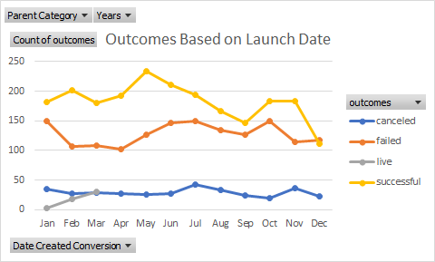
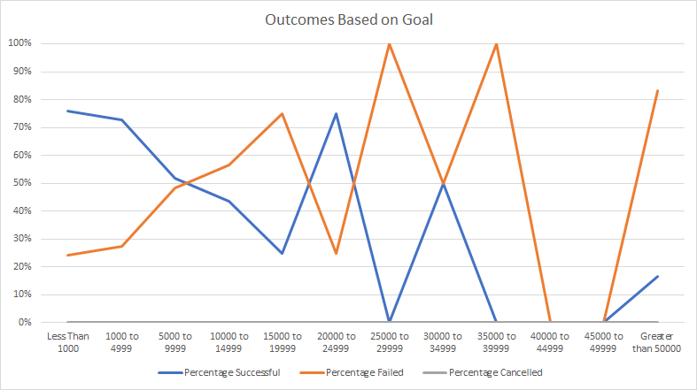

# An analysis of kickstarter campaigns
Performing Analysis on Kickstarter Data to uncover trends

### Challenge

The most glaring takewaway from the graphs above is first that Lousie would do well to launch her kickstarter in the months of May, June, July and not December, January as there are a greater number of successful theater kickerstarters in the former months compared to the latter. Secondly, though the data has a bit of noise and lacks smoothing, we can see a clear downward trend in the second graph pointing to the conclusion that theater play kickstarters exhibiting a lower degree of success as the goal get increasingly larger. Given the smaller sample sizes at higher levels of funding, the percentages are skewed a bit in the 20k-25k range. Thought they did exhibit at 75% suiccess rate, there were only 4 data points. I would think that if we had more data points we would we a lower level of success at this goal level. A recommened Goal level for Lousie would be less than 5000 as the success rate is above 70% for those, if she needs more funding she can go up to 10k with taking a bit more risk. Some additional tables and analysis that would be helpful is location based success rates on goal and launch date. Different geographies and affect weather patterns which may in turn affect the success rate of kickstarters. Some limitations of the data is that we cannot qualitatively say what type of plays (drama, comedy, thrillers, etc.) are successful at what rate, nor can we see what demographic of audience may contribute to the success rate of these kickstarters.
